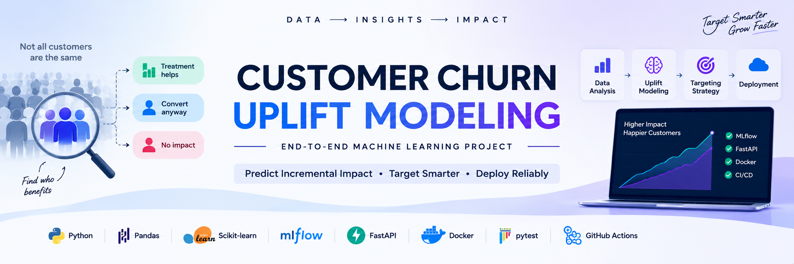

  

<h1 align="center">📊 CUSTOMER CHURN UPLIFT MODELING</h1>

  <b>End-to-End Machine Learning & Uplift Modeling Project</b>

  <b>Predict Incremental Impact • Target Smarter • Deploy Reliably</b>

  SDE / Machine Learning Project • Python • Scikit-learn • MLflow • FastAPI • Docker

  
  
  
  
  
  
  
  
  

📖 About the Project

Customer Churn Uplift Modeling is an end-to-end machine learning project focused on estimating the incremental impact of a treatment or intervention.

Traditional machine learning predicts which observations are likely to convert.

Uplift modeling goes one step further:

Which customers are likely to change their behavior
because of the treatment?

The project implements multiple uplift modeling strategies, evaluates their treatment-effect ranking performance, builds a treatment targeting policy, and packages the selected production model behind a FastAPI service.

The complete workflow follows a production-oriented machine learning lifecycle:

Data
  ↓
Data Understanding
  ↓
Data Quality
  ↓
EDA
  ↓
Feature Engineering
  ↓
Baseline Modeling
  ↓
Uplift Modeling
  ↓
Model Comparison
  ↓
Uplift Evaluation
  ↓
Treatment Targeting
  ↓
Production ML
  ↓
MLflow
  ↓
Model Registry
  ↓
FastAPI
  ↓
Docker
  ↓
Testing
  ↓
GitHub Actions

🎯 Project Objectives

The project focuses on:

📊 Understanding the Criteo uplift dataset

🧹 Performing data quality analysis

🔍 Conducting exploratory data analysis

🛠 Preparing machine learning features

🤖 Building baseline models

🧠 Implementing T-Learner

🧠 Implementing S-Learner

🧠 Implementing X-Learner

📈 Comparing uplift models

📊 Evaluating uplift performance

🎯 Building treatment targeting policies

🏭 Creating a production-oriented ML pipeline

🧪 Tracking experiments using MLflow

🗂 Managing model versions

🚀 Serving predictions through FastAPI

🧪 Testing the prediction API

🐳 Containerizing the application

⚙️ Running automated CI using GitHub Actions

💼 Business Problem

Traditional machine learning asks:

Who is likely to convert?

Uplift modeling asks:

Who is likely to convert BECAUSE of the treatment?

This distinction is important because some customers may convert even without receiving an intervention.

                Observation Population
                           │
          ┌────────────────┼────────────────┐
          │                │                │
          ▼                ▼                ▼
   Convert Anyway    Treatment Helps    Treatment Hurts
          │                │                │
          ▼                ▼                ▼
       Lower            High-value       Avoid
      Priority           Target         Treatment

The objective is therefore to prioritize customers based on incremental treatment effect, rather than simply predicted conversion probability.

🧠 What Is Uplift Modeling?

Uplift modeling estimates the difference between the expected outcome when a customer receives treatment and the expected outcome when the same customer does not receive treatment.

Expected Outcome
with Treatment
       │
       │
       ▼
   P(Y = 1 | X, T = 1)
       │
       │
       ├───────────────┐
                       │
                       ▼
                  UPLIFT SCORE
                       ▲
                       │
       ┌───────────────┘
       │
       ▼
   P(Y = 1 | X, T = 0)
       │
       ▼
Expected Outcome
without Treatment

Mathematically:

Uplift(X)
=
P(Y = 1 | X, T = 1)
-
P(Y = 1 | X, T = 0)

Where:

X = Input Features
T = Treatment Assignment
Y = Outcome

Interpretation

Positive Uplift
      ↓
Treatment is expected to improve the outcome

Near-Zero Uplift
      ↓
Treatment has little incremental impact

Negative Uplift
      ↓
Treatment may reduce the expected outcome

📊 Uplift Modeling Segments

Uplift scores can be used to divide observations into treatment-response groups.

                         UPLIFT SCORE
                              │
              ┌───────────────┼───────────────┐
              │               │               │
              ▼               ▼               ▼
        High Positive     Near Zero       Negative
              │               │               │
              ▼               ▼               ▼
       Strong treatment    Limited       Treatment
          candidate         benefit       may hurt
              │               │               │
              ▼               ▼               ▼
          PRIORITIZE       OPTIONAL        AVOID

A targeting strategy should generally prioritize observations with the highest predicted incremental benefit.

📊 Dataset

This project uses the:

Criteo Uplift Prediction Dataset v2.1

The dataset is designed for uplift modeling and incrementality analysis.

Official dataset source:

https://ailab.criteo.com/criteo-uplift-prediction-dataset/

The dataset contains approximately 14 million observations.

🧾 Dataset Columns

f0
f1
f2
f3
f4
f5
f6
f7
f8
f9
f10
f11
treatment
conversion
visit
exposure

Feature Groups

Input Features
       │
       ├── f0
       ├── f1
       ├── f2
       ├── ...
       └── f11

Treatment Information
       │
       └── treatment

Outcome Information
       │
       ├── conversion
       ├── visit
       └── exposure

The primary predictive feature set consists of:

f0 - f11

Treatment and outcome variables are handled separately from the predictive feature matrix.

🔍 Data Understanding

The data understanding stage examines:

Dataset dimensions

Column names

Data types

Feature structure

Treatment assignment

Outcome variables

Feature distributions

Basic descriptive statistics

Treatment/control structure

The goal is to understand the data before applying machine learning algorithms.

🧹 Data Quality

The data quality workflow checks:

Raw Dataset
     │
     ▼
Missing Values
     │
     ▼
Duplicate Records
     │
     ▼
Data Types
     │
     ▼
Treatment Distribution
     │
     ▼
Outcome Distribution
     │
     ▼
Feature Statistics
     │
     ▼
Treatment / Control Balance
     │
     ▼
Leakage Checks

The workflow also avoids using post-treatment information as predictive model input.

📊 Exploratory Data Analysis

The EDA stage investigates:

Treatment/control balance

Conversion rate

Visit rate

Exposure rate

Feature distributions

Feature correlations

Treatment differences

Outcome relationships

Treatment Analysis

                 Dataset
                    │
          ┌─────────┴─────────┐
          ▼                   ▼
      Treatment            Control
        Group                Group
          │                   │
          ▼                   ▼
      Outcomes             Outcomes
          │                   │
          └─────────┬─────────┘
                    ▼
             Compare Groups

EDA helps identify patterns that may influence treatment effectiveness.

🛠️ Feature Engineering

The feature engineering stage prepares the available Criteo features for machine learning.

Primary modeling features:

f0 - f11

The resulting feature matrix is used by the uplift learners to estimate treatment effects.

Raw Features
     │
     ▼
Feature Selection
     │
     ▼
Feature Preparation
     │
     ▼
Modeling Matrix X

🤖 Machine Learning Methodology

The project implements and compares three major uplift modeling approaches:

             UPLIFT MODELING
                    │
        ┌───────────┼───────────┐
        ▼           ▼           ▼
    T-Learner    S-Learner   X-Learner
        │           │           │
        └───────────┼───────────┘
                    ▼
             Model Comparison
                    │
                    ▼
             Best Strategy

1️⃣ T-Learner

The T-Learner trains separate outcome models for treatment and control groups.

                         Dataset
                            │
                 ┌──────────┴──────────┐
                 │                     │
                 ▼                     ▼
             Control               Treatment
              Group                  Group
                 │                     │
                 ▼                     ▼
          Control Model        Treatment Model
                 │                     │
                 ▼                     ▼
        P(Y | X, T=0)          P(Y | X, T=1)
                 │                     │
                 └──────────┬──────────┘
                            ▼
                    Treatment Effect
                            │
                            ▼
                     Uplift Score

The uplift score is calculated as:

Uplift
=
Treatment Prediction
-
Control Prediction

Advantages

Simple to understand

Easy to implement

Allows different models for treatment/control

Useful baseline uplift approach

Limitation

The two models may perform differently if treatment and control populations have different characteristics.

2️⃣ S-Learner

The S-Learner uses a single model where treatment assignment is included as an input feature.

              Customer Features
                      +
                 Treatment
                      │
                      ▼
                Single Model
                      │
             ┌────────┴────────┐
             ▼                 ▼
       Treatment = 1      Treatment = 0
             │                 │
             ▼                 ▼
       Prediction(1)      Prediction(0)
             │                 │
             └────────┬────────┘
                      ▼
                 Difference
                      │
                      ▼
                 Uplift Score

Mathematically:

Uplift
=
Model(X, T=1)
-
Model(X, T=0)

Advantages

Simple architecture

Only one model is required

Treatment can be incorporated directly as a feature

Limitation

The treatment variable may have limited influence compared with the other features.

3️⃣ X-Learner

The X-Learner uses outcome models and treatment-effect models to estimate individual treatment effects.

                         Dataset
                            │
                 ┌──────────┴──────────┐
                 │                     │
                 ▼                     ▼
             Treatment             Control
               Group                 Group
                 │                     │
                 ▼                     ▼
          Outcome Model         Outcome Model
                 │                     │
                 └──────────┬──────────┘
                            ▼
                 Treatment Effects
                    Estimation
                            │
                            ▼
                    Effect Models
                            │
                            ▼
                     Final Uplift

The X-Learner is particularly useful when treatment and control populations have different sizes or characteristics.

📊 Model Comparison

The three approaches are compared based on their ability to rank observations according to incremental treatment effect.

T-Learner
    │
    ▼
Uplift Predictions
    │
    ├───────────────┐
    ▼               ▼
S-Learner       X-Learner
    │               │
    └───────┬───────┘
            ▼
       Evaluation
            │
            ▼
      Model Ranking

Comparison focuses on uplift-specific metrics rather than only conventional classification accuracy.

📈 Uplift Model Evaluation

Uplift models require evaluation methods that measure treatment-effect ranking.

The project evaluates models using:

Qini Curve

Qini Coefficient

Uplift@K

Treatment targeting performance

📈 Qini Curve

The Qini curve measures how effectively a model ranks observations according to expected incremental treatment effect.

Cumulative
Incremental
Gain
  │
  │                         ╱
  │                      ╱
  │                   ╱
  │                ╱
  │             ╱
  │          ╱
  │_______╱________________________
          Targeted Population

The model should ideally prioritize observations with high expected incremental benefit.

📊 Uplift@K

Uplift@K measures the incremental effect achieved when targeting the top K% of observations ranked by predicted uplift.

All Observations
       │
       ▼
Rank by Uplift
       │
       ▼
┌─────────────────────────┐
│ Top 10%                 │
│ Top 20%                 │
│ Top 30%                 │
│ Top 40%                 │
│ ...                     │
└─────────────────────────┘
       │
       ▼
Measure Incremental Effect

This provides a practical way to evaluate treatment targeting policies.

🎯 Treatment Targeting Policy

Predicted uplift scores are converted into an actionable treatment policy.

Predicted Uplift
       │
       ▼
Rank Observations
       │
       ▼
Highest Uplift First
       │
       ▼
Select Top K%
       │
       ▼
Treatment Policy
       │
       ▼
Deploy Intervention

Example

Observation A → +0.42
Observation B → +0.31
Observation C → +0.18
Observation D → +0.04
Observation E → -0.12

The targeting policy prioritizes:

Observation A
      ↓
Observation B
      ↓
Observation C

while lower or negative uplift observations receive lower priority.

🏭 Production ML Pipeline

The production-oriented pipeline performs:

                    Load Data
                        │
                        ▼
                  Select Features
                        │
                        ▼
             Separate Treatment /
                  Control Groups
                        │
                        ▼
               Train Outcome Models
                        │
                        ▼
              Generate Uplift Scores
                        │
                        ▼
                Evaluate Model
                        │
                        ▼
               Save Model Artifacts
                        │
                        ▼
                  Save Metrics
                        │
                        ▼
                Register Model

The production pipeline separates experimentation from reusable model artifacts.

🔬 MLflow Experiment Tracking

MLflow is used to track machine learning experiments and model versions.

                ML Experiment
                     │
          ┌──────────┼──────────┐
          ▼          ▼          ▼
       Parameters  Metrics   Artifacts
          │          │          │
          └──────────┼──────────┘
                     ▼
                  MLflow
                     │
                     ▼
             Experiment History

Tracked information can include:

Model Parameters
Training Configuration
Evaluation Metrics
Model Artifacts
Experiment Runs
Model Versions

🗂️ Model Registry

The model registry provides a structured lifecycle for production models.

Training
   │
   ▼
Experiment Run
   │
   ▼
Model Artifact
   │
   ▼
MLflow Registry
   │
   ├── Version 1
   ├── Version 2
   └── Version 3
          │
          ▼
       Selected
          │
          ▼
      Production

This allows models to be versioned and tracked throughout their lifecycle.

🚀 FastAPI Model Serving

The trained production T-Learner is exposed through a REST API using FastAPI.

The API loads the trained model artifacts:

API Input

The prediction API accepts the following 12 input features:

f0, f1, f2, f3, f4, f5, f6, f7, f8, f9, f10, f11

Treatment is not provided in the prediction request because the
T-Learner internally estimates both treatment and control outcomes.

models/
├── t_learner_control_model.joblib
└── t_learner_treatment_model.joblib

🔌 Prediction API Flow

Client
  │
  │ POST Prediction Request
  ▼
FastAPI
  │
  ▼
Validate Input
  │
  ▼
Load Model
  │
  ├───────────────┐
  ▼               ▼
Control Model   Treatment Model
  │               │
  ▼               ▼
P(Y|X,T=0)      P(Y|X,T=1)
  │               │
  └───────┬───────┘
          ▼
    Calculate Uplift
          │
          ▼
      JSON Response

🧪 Automated Testing

The API is tested using:

pytest

Testing verifies:

API availability

Request validation

Valid prediction requests

Response structure

Prediction output

Error handling

Testing flow:

Code
 │
 ▼
pytest
 │
 ├── API Tests
 ├── Validation Tests
 └── Prediction Tests
 │
 ▼
Test Result

🐳 Docker Containerization

The application can be packaged into a Docker container.

Application
    │
    ├── FastAPI
    ├── Models
    ├── Dependencies
    └── Configuration
           │
           ▼
       Dockerfile
           │
           ▼
      Docker Image
           │
           ▼
       Container

Docker provides a consistent runtime environment for the model-serving application.

🔄 Docker Compose

Docker Compose simplifies running the application environment.

              docker-compose.yml
                       │
                       ▼
                Application
                       │
                       ├── API
                       ├── Model
                       └── Dependencies
                       │
                       ▼
                  Running Stack

⚙️ Continuous Integration

GitHub Actions automatically runs the test workflow.

Developer Push
      │
      ▼
    GitHub
      │
      ▼
GitHub Actions
      │
      ▼
Install Dependencies
      │
      ▼
Run Pytest
      │
      ▼
┌─────┴─────┐
▼           ▼
PASS       FAIL
│           │
▼           ▼
CI ✓       Fix Code

This helps ensure that changes do not break the API or existing functionality.

📂 Repository Structure

customer-churn-uplift-modeling/
│
├── .github/
│   └── workflows/
│       └── tests.yml
│
├── api/
│   └── app.py
│
├── data/
│   ├── raw/
│   ├── interim/
│   └── processed/
│
├── models/
│   ├── t_learner_control_model.joblib
│   ├── t_learner_treatment_model.joblib
│   ├── t_learner_model_metadata.json
│  
│
├── notebooks/
│   ├── 01_data_understanding.ipynb
│   ├── 02_data_quality.ipynb
│   ├── 03_eda.ipynb
│   ├── 04_feature_engineering.ipynb
│   ├── 05_baseline_modeling.ipynb
│   ├── 06_uplift_modeling_t_learner.ipynb
│   ├── 07_uplift_evaluation.ipynb
│   ├── 08_uplift_model_comparison.ipynb
│   ├── 09_treatment_targeting_policy.ipynb
│   ├── 10_production_ml_pipeline.ipynb
│   ├── 11_experiment_tracking.ipynb
│   ├── 12_model_registry.ipynb
│   ├── 13_api_model_serving.ipynb
│   └── 14_api_testing.ipynb
│
├── reports/
│   └── production_model_metrics.csv
│
├── src/
│   └── uplift/
│       ├── __init__.py
│       └── t_learner.py
│
├── tests/
│   ├── conftest.py
│   └── test_api.py
│
├── .dockerignore
├── .gitignore
├── CHANGELOG.md
├── docker-compose.yml
├── Dockerfile
├── LICENSE
├── Makefile
├── pyproject.toml
├── README.md
└── requirements.txt

📓 Notebook Workflow

#

Notebook

Purpose

01

01_data_understanding.ipynb

Dataset structure and initial understanding

02

02_data_quality.ipynb

Data quality analysis and validation

03

03_eda.ipynb

Exploratory data analysis

04

04_feature_engineering.ipynb

Feature preparation

05

05_baseline_modeling.ipynb

Baseline machine learning

06

06_uplift_modeling_t_learner.ipynb

T-Learner implementation

07

07_uplift_evaluation.ipynb

Uplift evaluation

08

08_uplift_model_comparison.ipynb

T/S/X Learner comparison

09

09_treatment_targeting_policy.ipynb

Treatment targeting strategy

10

10_production_ml_pipeline.ipynb

Production-oriented ML pipeline

11

11_experiment_tracking.ipynb

MLflow experiment tracking

12

12_model_registry.ipynb

MLflow model registry

13

13_api_model_serving.ipynb

FastAPI model serving

14

14_api_testing.ipynb

API testing

🔄 Complete End-to-End Architecture

                           DATASET
                              │
                              ▼
                    ┌──────────────────┐
                    │ Data Understanding│
                    └────────┬─────────┘
                             │
                             ▼
                    ┌──────────────────┐
                    │  Data Quality    │
                    └────────┬─────────┘
                             │
                             ▼
                    ┌──────────────────┐
                    │       EDA        │
                    └────────┬─────────┘
                             │
                             ▼
                    ┌──────────────────┐
                    │Feature Engineering│
                    └────────┬─────────┘
                             │
                             ▼
                    ┌──────────────────┐
                    │Baseline Modeling │
                    └────────┬─────────┘
                             │
                             ▼
                  ┌────────────────────────┐
                  │    Uplift Modeling     │
                  └───────────┬────────────┘
                              │
                 ┌────────────┼────────────┐
                 ▼            ▼            ▼
             T-Learner    S-Learner    X-Learner
                 │            │            │
                 └────────────┼────────────┘
                              ▼
                     Model Comparison
                              │
                              ▼
                      Uplift Evaluation
                              │
                              ▼
                   Treatment Targeting
                              │
                              ▼
                    Production Pipeline
                              │
                    ┌─────────┴─────────┐
                    ▼                   ▼
                 MLflow              FastAPI
                    │                   │
                    ▼                   ▼
               Model Registry       Model Serving
                                        │
                                        ▼
                                     Docker
                                        │
                                        ▼
                                Automated Testing
                                        │
                                        ▼
                                 GitHub Actions

📌 Complete Application Workflow

                  Raw Dataset
                       │
                       ▼
               Understand Data
                       │
                       ▼
                Clean / Validate
                       │
                       ▼
                   Explore
                       │
                       ▼
             Prepare Features
                       │
                       ▼
              Train ML Models
                       │
                       ▼
            Estimate Treatment
                   Effects
                       │
                       ▼
              Generate Uplift
                   Scores
                       │
                       ▼
             Evaluate Ranking
                       │
                       ▼
             Select Top Targets
                       │
                       ▼
             Treatment Policy
                       │
                       ▼
              Production Model
                       │
                       ▼
               Register Model
                       │
                       ▼
                 FastAPI
                       │
                       ▼
                  Docker
                       │
                       ▼
                 CI Testing

📊 Treatment Effect Decision Flow

               Observation
                    │
                    ▼
              Feature Vector X
                    │
                    ▼
              Uplift Model
                    │
                    ▼
             Predicted Uplift
                    │
          ┌─────────┼─────────┐
          ▼         ▼         ▼
       Positive    Zero     Negative
          │         │         │
          ▼         ▼         ▼
      Treatment   Neutral    Avoid
       Candidate   Effect   Treatment

🔬 Model Lifecycle

Experiment
    │
    ▼
Train Model
    │
    ▼
Evaluate
    │
    ▼
Track with MLflow
    │
    ▼
Register Version
    │
    ▼
Validate
    │
    ▼
Deploy
    │
    ▼
Serve Predictions
    │
    ▼
Monitor / Improve
    │
    └───────────────► New Experiment

🛠️ Engineering Practices

The project follows practical machine learning engineering principles.

Separation of Concerns

Data analysis, model training, API serving, testing, and deployment responsibilities are separated.

Reproducible Experiments

MLflow provides experiment tracking and model version management.

Modular Modeling

The uplift modeling logic is separated into reusable source modules.

Model Serialization

Trained models are stored using Joblib for later inference.

API-Based Serving

The trained model is exposed through a REST API using FastAPI.

Automated Testing

Pytest validates the API behavior and prediction workflow.

Containerization

Docker packages the API, models, and runtime dependencies.

Continuous Integration

GitHub Actions automatically executes the test suite when changes are pushed.

⚙️ Installation

Clone the repository:

git clone https://github.com/potnuruteja115/customer-churn-uplift-modeling.git

Navigate into the project:

cd customer-churn-uplift-modeling

Create a virtual environment:

python -m venv .venv

Activate the environment.

Windows

.venv\Scripts\activate

Linux / macOS

source .venv/bin/activate

Install dependencies:

pip install -r requirements.txt

▶️ Running the Project

Run the notebooks

Start Jupyter:

jupyter notebook

Execute the notebooks in sequence:

01 → 02 → 03 → 04 → 05
        ↓
06 → 07 → 08 → 09
        ↓
10 → 11 → 12 → 13 → 14

🚀 Run FastAPI

Start the API:

uvicorn api.app:app --reload

The API will be available locally through the FastAPI development server.

Interactive API documentation:

/docs

🧪 Run Tests

Execute:

pytest

For verbose output:

pytest -v

🐳 Run with Docker

Build the image:

docker build -t customer-uplift-api:latest . 

Run the container:

docker run -p 8000:8000 customer-uplift-api:latest

🐳 Run with Docker Compose

docker compose up -d

Stop the services:

docker compose down

🔌 API Architecture

                   Client
                     │
                     ▼
                FastAPI API
                     │
                     ▼
              Request Validation
                     │
                     ▼
              Prediction Service
                     │
          ┌──────────┴──────────┐
          ▼                     ▼
   Control Model          Treatment Model
          │                     │
          ▼                     ▼
    Control Score         Treatment Score
          │                     │
          └──────────┬──────────┘
                     ▼
               Uplift Score
                     │
                     ▼
                JSON Response

📦 API Prediction Concept

A prediction request provides the required feature values.

The model then estimates:

Treatment Outcome
        -
Control Outcome
        =
Uplift Score

Example:

Treatment Prediction = 0.72

Control Prediction   = 0.45

Uplift                = 0.27

Interpretation:

The estimated incremental treatment effect is +0.27.

📈 Evaluation Metrics

Metric

Purpose

Qini Curve

Visualizes cumulative incremental gain

Qini Coefficient

Measures uplift ranking performance

Uplift@K

Measures incremental effect among top K targets

Treatment Targeting

Evaluates practical targeting performance

🧰 Technology Stack

Technology

Purpose

Python

Core programming language

Pandas

Data manipulation

NumPy

Numerical computing

Scikit-learn

Machine learning

Random Forest

Outcome and treatment-effect modeling

Jupyter Notebook

Data science experimentation

MLflow

Experiment tracking and model registry

FastAPI

REST API model serving

Pydantic

API validation

Joblib

Model serialization

Pytest

Automated testing

Docker

Containerization

Docker Compose

Local container orchestration

Git

Version control

GitHub

Source control and collaboration

GitHub Actions

Continuous integration

📦 Deliverables

✅ Data Understanding

✅ Data Quality Analysis

✅ Exploratory Data Analysis

✅ Feature Engineering

✅ Baseline Modeling

✅ T-Learner

✅ S-Learner

✅ X-Learner

✅ Uplift Model Comparison

✅ Qini Evaluation

✅ Uplift@K Analysis

✅ Treatment Targeting Policy

✅ Production ML Pipeline

✅ MLflow Experiment Tracking

✅ Model Registry

✅ FastAPI REST API

✅ Automated API Tests

✅ Docker Image

✅ Docker Compose

✅ GitHub Actions CI

✅ Technical Documentation

🎓 Learning Outcomes

This project demonstrates practical understanding of:

Data Science
      +
Machine Learning
      +
Treatment Effect Estimation
      +
Uplift Modeling
      +
T-Learner
      +
S-Learner
      +
X-Learner
      +
Model Evaluation
      +
Treatment Targeting
      +
Experiment Tracking
      +
Model Registry
      +
Production ML
      +
REST API Development
      +
Containerization
      +
Automated Testing
      +
Continuous Integration

⭐ Project Highlights

End-to-End Machine Learning

Raw Data
   ↓
EDA
   ↓
Feature Engineering
   ↓
Model Training
   ↓
Uplift Estimation
   ↓
Evaluation
   ↓
Targeting
   ↓
Deployment

Multiple Uplift Strategies

                 Uplift Modeling
                       │
          ┌────────────┼────────────┐
          ▼            ▼            ▼
      T-Learner    S-Learner    X-Learner
          │            │            │
          └────────────┼────────────┘
                       ▼
                Model Comparison

Production-Oriented ML

Model
  ↓
MLflow
  ↓
Registry
  ↓
FastAPI
  ↓
Docker
  ↓
Pytest
  ↓
GitHub Actions

🔮 Future Improvements

The architecture can be extended with:

🗄️ Database integration

📊 Model monitoring

📈 Drift detection

🔄 Automated model retraining

☁️ Cloud deployment

🔐 API authentication

📡 Production logging

📊 Real-time dashboards

🎯 Cost-aware treatment optimization

💰 ROI-based targeting

🧠 Advanced causal inference methods

⚡ Batch prediction pipelines

🔁 Scheduled retraining workflows

🏁 Conclusion

This project demonstrates the complete journey from exploratory data science to a production-oriented uplift modeling system.

The final workflow combines:

Data Understanding
      +
Data Quality
      +
Exploratory Analysis
      +
Feature Engineering
      +
Machine Learning
      +
Uplift Modeling
      +
Treatment Effect Estimation
      +
Model Evaluation
      +
Treatment Targeting
      +
Experiment Tracking
      +
Model Registry
      +
FastAPI
      +
Docker
      +
Automated Testing
      +
GitHub Actions

The key objective is not simply to predict who is likely to convert, but to identify who is most likely to benefit from an intervention.

                 PREDICT
                    │
                    ▼
              WHO WILL ACT?
                    │
                    ▼
                 ESTIMATE
                    │
                    ▼
           WHO WILL BENEFIT?
                    │
                    ▼
                TARGET
                    │
                    ▼
             TREAT SMARTER

👨‍💻 Author

Teja Potnuru

Customer Churn Uplift Modeling — End-to-End Machine Learning Project

📄 License

This project is intended for educational, research, portfolio, and demonstration purposes.

  <b>Built with Python, Scikit-learn, MLflow & FastAPI</b>

  <i>Predict Incremental Impact • Target Smarter • Deploy Reliably</i>

